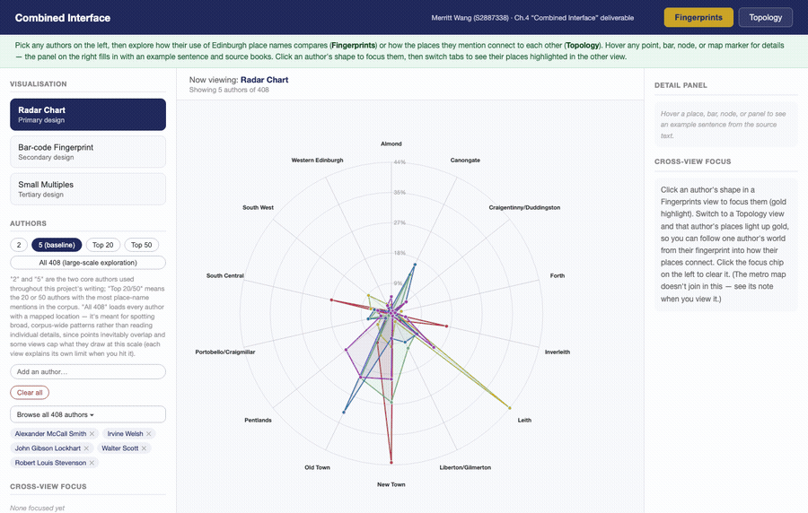
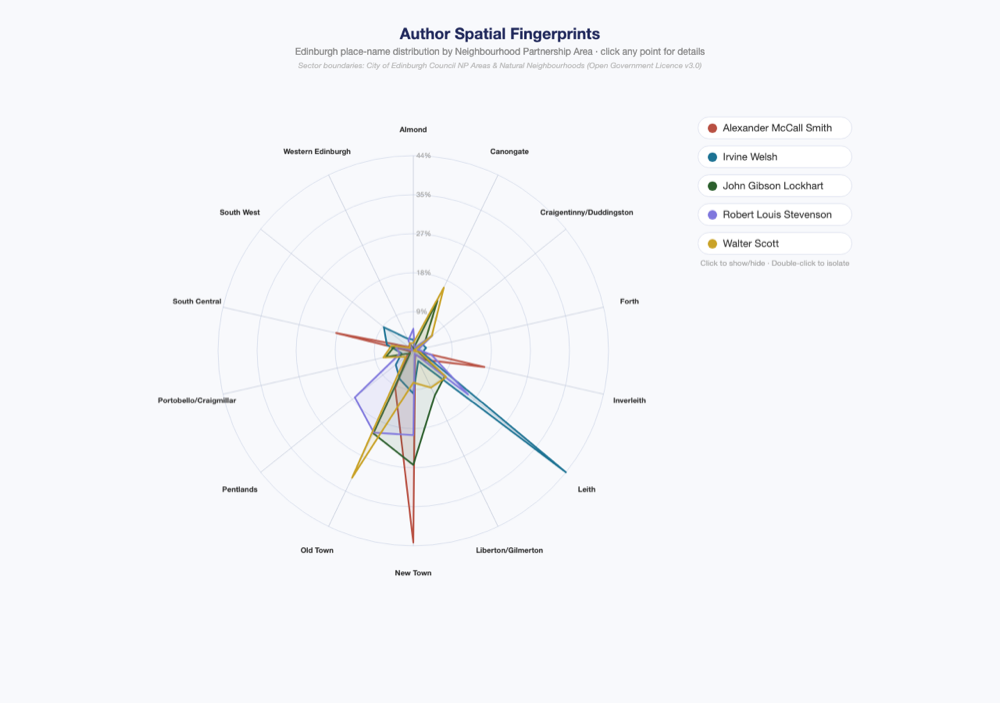
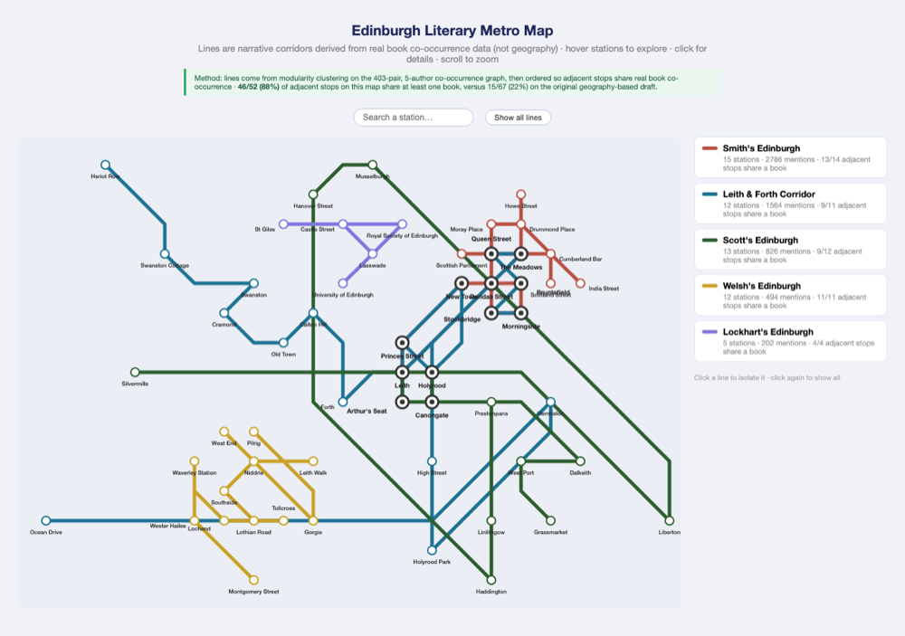
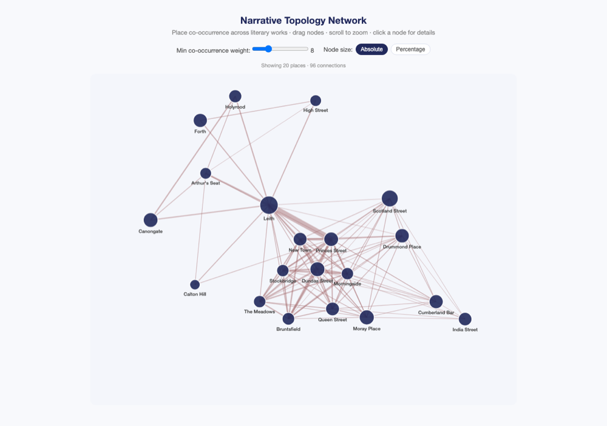
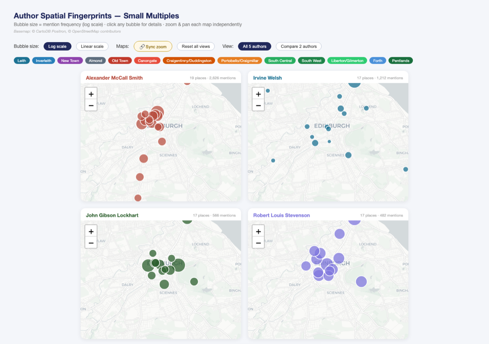
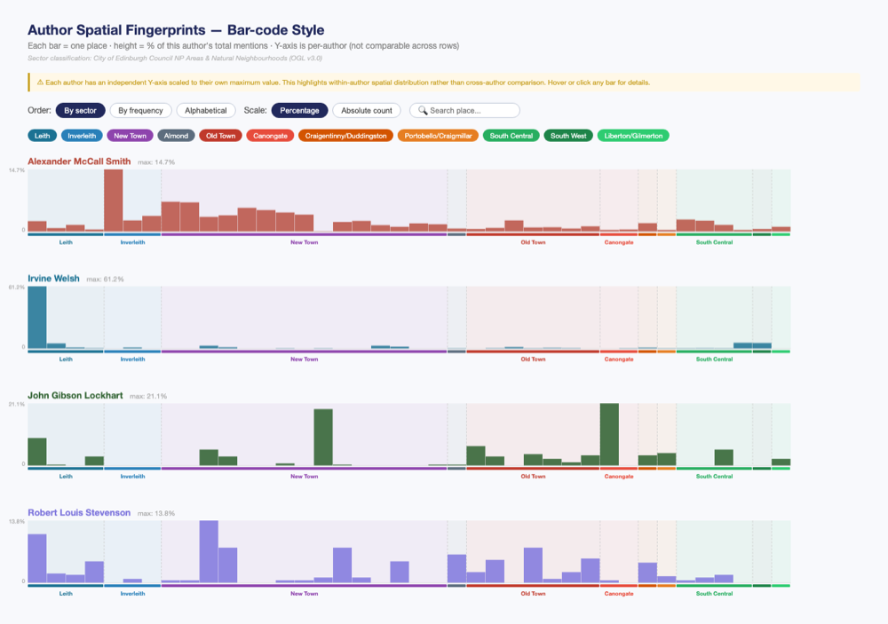
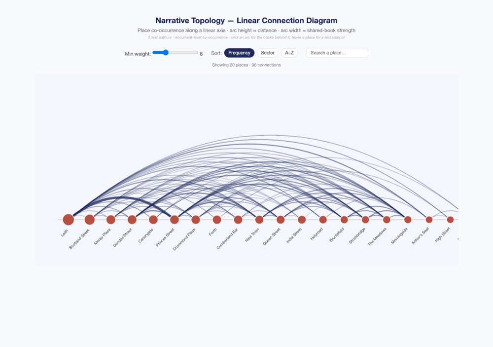

# A Visual Trace Map of Edinburgh Place Names in Literature

   

**MSc Dissertation** · University of Edinburgh, School of Informatics · 2025–2026
**Student**: Merritt Wang (S2887338) · **Supervisor**: Uta Hinrichs (VisHub) · **Second supervisor**: Nina Pardal

---

**Contents**: [Overview](#overview) · [Live Demo](#live-demo) · [Key Findings](#key-findings) · [The Six Visualisations](#the-six-visualisations) · [Scale Exploration](#scale-exploration-dataprocessedscale_exploration) · [Repository Structure](#repository-structure) · [Database Setup](#database-setup) · [Python Environment](#python-environment) · [Testing](#testing) · [Five Test Authors](#five-test-authors) · [14 Spatial Sectors](#14-spatial-sectors) · [Technical Notes](#technical-notes) · [Completed Since the Original Prototype](#completed-since-the-original-prototype) · [User Study](#user-study) · [Planned / Open](#planned--open) · [Key References](#key-references) · [License](#license)

---

## Overview

Interactive visualisation system for literary place names in Edinburgh, built on the [LitLong Edinburgh](http://litlong.org) database (620 literary works, 424 authors, 2,135 place names, 50,248 mention records).

**[Read the full dissertation (PDF)](dissertation/20Aug/A_Visual_Trace_Map_of_Edinburgh_Place_Names_in_Literature.pdf)** — for the write-up itself, rather than the interactive system below. This is the submission version: user study results (Chapters 5–7) are written up from the completed n=13 study, and the bibliography has been expanded. ⚠️ The bibliography and a handful of citation insertions were edited after this PDF was last compiled — recompile from `dissertation/20Aug/dissertation.tex` before final submission.

Core argument: place names in literary text should be visualised as **narrative structure**, not as geographic information. Existing tools plot mentions on a map; this project asks what a literary corpus looks like when narrative co-occurrence and authorial spatial attention — not latitude and longitude — are the primary encoding.

### Two Research Directions

**Direction 1 — Author Spatial Fingerprints**
Does each author's distribution of place-name mentions across the city form a visually distinctive spatial "fingerprint," recognisable without prior knowledge of their work?

**Direction 2 — Narrative Topology Networks**
Does the co-occurrence of place names across literary works reveal a narrative topology that diverges from Edinburgh's geographic topology?

---

## Live Demo

**[Open the live link](https://merrittw-1307.github.io/uoe-edinburgh-literary-geovis/)** — a landing page linking all six visualisations, served via GitHub Pages from `index.html` at the repo root.

Every file is also self-contained and can be opened locally by double-clicking — no server or build step required. Data is embedded directly as JavaScript objects in each HTML file (browsers block local file reads under `file://`, so nothing is fetched at runtime).

| | |
|---|---|
|  |  |
|  |  |
|  |  |

**[Combined Interface](data/processed/combined/d3/combined_interface.html)** (`data/processed/combined/`) puts all six visualisations behind a single shared author selector — presets for 2/5/20/50 authors, an "All 408" preset for large-scale exploration, a type-to-search box, and a browsable checklist of all 408 authors for a fully custom selection — plus cross-view linking (click an author in a Fingerprints view to highlight their places in a Topology view) and a detail panel that shows names, counts, percentages, and a real example sentence on hover. Rendering is capped (1,500 strongest edges for network/linear, 50 live map instances for small multiples) so it stays responsive at any selection size; metro switches between four precomputed snapshots (2/5/20/50 authors) instead of joining the live selection, since redrawing its lines from scratch isn't practical client-side. Built with `data/processed/combined/py/build_combined_interface.py`; this is a supplementary exploration tool, not part of the formal user study (see [User Study](#user-study) below).

---

## Key Findings

- Among the five test authors, **zero place names are shared by three or more authors**, and only 18 by any two — each author constructs an almost entirely private imaginary Edinburgh. This is why the fingerprint charts use 14 official city sectors as axes rather than individual place names (Section 3.5 of the dissertation).
- **Leith and Princes Street** are the strongest co-occurring place pair in the corpus (28 shared works) despite being ~2.5km apart — narrative proximity does not track geographic proximity. This is the central empirical evidence for Direction 2's research question.
- Sector distributions independently reproduce known literary-geographic facts: McCall Smith concentrates in **New Town** (43.6%, Scotland Street series), Welsh in **Leith** (44.3%, *Trainspotting*), Scott in **Old Town** (32.0%, historical fiction).
- Rebuilding the metro-style map's line structure from real co-occurrence data (community detection, not hand-drawn geography) raises the proportion of "adjacent stations that share a real book" from 22% to 88% — see `data/processed/dir_2/metro/`.
- A scale-exploration pass (`data/processed/scale_exploration/`) found that each of the six designs fails at a larger author count in a *different* specific way — visual overlap, scroll length, horizontal sprawl, real computational cost, and algorithmic breakdown are all distinct failure modes, not one shared "too crowded" problem.

---

## The Six Visualisations

All use the same five test authors (Alexander McCall Smith, Irvine Welsh, John Gibson Lockhart, Walter Scott, Robert Louis Stevenson) and are the versions described in the dissertation.

| File | Direction | Description |
|------|-----------|--------------|
| `data/processed/dir_1/radar/d3/radar.html` | 1 (primary) | Radar chart across 14 official city sectors. Click a vertex for a detail panel (top places, top books); hover a place row for an example sentence. Legend supports show/hide and isolate. |
| `data/processed/dir_1/barcode/d3/barcode.html` | 1 (secondary) | Bar-code fingerprint, one bar per place, **independent Y-axis per author**. Sortable by sector/frequency/alphabet, searchable, click a bar for books + an example sentence. |
| `data/processed/dir_1/small_multiples/d3/small_multiples.html` | 1 (tertiary) | Five real Leaflet.js maps (CartoDB Positron) side by side. Sector-legend filter, log/linear bubble-size toggle, sync-zoom, and a "compare 2 authors" mode with larger panels. |
| `data/processed/dir_2/network/d3/network.html` | 2 (primary) | Force-directed graph of the full 403-pair document-level co-occurrence network. Weight-threshold slider (1–28), drag nodes, click a node for co-occurring places/books/an example sentence, absolute/percentage size toggle. |
| `data/processed/dir_2/linear/d3/linear.html` | 2 (secondary) | Places on a single horizontal axis, Bézier arcs for co-occurrence. Weight slider, sort by frequency/sector/alphabet, click an arc for the shared book list, search. |
| `data/processed/dir_2/metro/d3/metro.html` | 2 (illustrative) | Metro-style map in the visual language of the London Underground — but the five lines are derived from **modularity community detection on real co-occurrence data**, not hand-drawn geography (see Finding above). Click a line to isolate it, click a station for details, search. |

Older iterations of each file are kept alongside as `*_v1.html`, `*_v2.html`, etc. so the design history is preserved; the un-suffixed filename is always the current version described in the dissertation.

---

## Scale Exploration (`data/processed/scale_exploration/`)

A follow-up investigation, kept fully separate from the six canonical files above, testing how each design behaves from 2 authors up to all 408 authors with location data (and, for network/linear, an arbitrary 2–3 book selection). Four of the six get a live, interactive re-implementation that recomputes its data client-side; small multiples measures real Leaflet-panel rendering cost; metro re-runs its community-detection pipeline as a batch comparison (no practical client-side equivalent for `networkx`-based clustering). Full methodology, every scope decision, and all findings are recorded in [`data/processed/scale_exploration/NOTES.md`](data/processed/scale_exploration/NOTES.md), and the headline results are in the dissertation's Limitations chapter and its "Scale Exploration Summary" appendix table.

---

## Repository Structure

    Dissertation/
    ├── index.html                                GitHub Pages landing page (live link)
    ├── data/
    │   ├── raw/
    │   │   ├── sql/                              litlong_original.sql EXCLUDED (145MB) — see .gitignore
    │   │   └── csv_snapshot/                      CSV exports of core tables
    │   └── processed/
    │       ├── sectors/                           14-sector place classification (location_sectors_v2.csv)
    │       ├── dir_1/                              Direction 1: Author Spatial Fingerprints
    │       │   ├── radar/          py, d3, data
    │       │   ├── barcode/        py, d3, data
    │       │   └── small_multiples/ py, d3, data
    │       ├── dir_2/                              Direction 2: Narrative Topology Networks
    │       │   ├── network/        py, d3, data
    │       │   ├── linear/         py, d3, data
    │       │   └── metro/          py, d3, data
    │       ├── combined/                           Combined Interface: all six views, one author selector
    │       │   ├── py/, d3/ (incl. history/ of prior versions), data/
    │       └── scale_exploration/                  Author/book-count scaling investigation (see above)
    │           ├── py/, d3/, data/, NOTES.md
    ├── dissertation/
    │   └── 20Aug/                                  LaTeX source and compiled PDF (submission version)
    ├── ethics/                                     Ethics approval and study forms (#446635)
    │   ├── study_stimuli/                          Blind/matching stimulus variants for the fingerprint task
    │   └── survey_data/                            User study analysis script + aggregate results (py/, processed/)
    ├── proposal/                                   Project proposal and reading materials
    ├── report/
    │   ├── midterm_report/                         Midterm progress report (LaTeX + PDF)
    │   └── presentations/                          Supervisor presentations
    └── docs/                                       Screenshots and social-preview image used above

---

## Database Setup

    brew install postgresql@16
    brew services start postgresql@16
    createdb litlong_edinburgh
    psql litlong_edinburgh < data/raw/sql/litlong_schema.sql

The full data dump (`litlong_original.sql`, 145MB) is excluded from the repo — contact Merritt Wang for access, then:

    psql litlong_edinburgh < data/raw/sql/litlong_original.sql

No password is required locally (peer auth) — the scripts default to `postgresql://localhost:5432/litlong_edinburgh` (peer auth uses your own OS username automatically). Override with an environment variable if your setup differs:

    export LITLONG_DB_URL="postgresql://youruser@localhost:5432/litlong_edinburgh"

Similarly, every script locates the repo root automatically by walking up to the nearest `.git` directory; set `DISSERTATION_REPO_ROOT` if you need to override that (e.g. running from a copy without git history).

---

## Python Environment

Data-generation scripts require Python 3.11+ with:

    pip install pandas sqlalchemy psycopg2-binary networkx

On macOS, the system Python (`/usr/bin/python3`) is sandboxed in a way that breaks some of these scripts (e.g. `os.getcwd()` inside `http.server`) and does not have these packages installed — use a separate interpreter such as Homebrew's `/usr/local/bin/python3.11` instead.

Scripts that touch the metro-map community-detection pipeline (`data/processed/dir_2/metro/py/build_metro_lines.py` and everything in `scale_exploration/py/` that imports it) should be run with a fixed hash seed for byte-identical output, since Python's hash randomisation affects tie-breaking inside `networkx.community.greedy_modularity_communities`:

    PYTHONHASHSEED=0 python3.11 build_metro_lines.py

---

## Testing

    pip install -r requirements-dev.txt
    pytest -v

The suite (`tests/`) doesn't touch the database — it validates the derived data files actually shipped in the repo against the specific numbers the dissertation reports, so a regeneration that silently changes a figure (edge count, sector breakdown, an author's dominant sector) fails loudly instead of quietly going stale. `test_cooccurrence_algorithm.py` is the one exception: a self-contained, data-free test of the document-level co-occurrence method itself (Finding 3), including the sentence-level granularity argument. Runs automatically on every push via GitHub Actions.

---

## Five Test Authors

| Author | Mentions | Works | Dominant sector | % |
|--------|----------|-------|------------------|---|
| Alexander McCall Smith | 7,320 | 17 | New Town | 43.6 |
| Irvine Welsh | 2,634 | 8 | Leith | 44.3 |
| John Gibson Lockhart | 3,046 | 6 | New Town | 25.9 |
| Walter Scott | 2,796 | 12 | Old Town | 32.0 |
| Robert Louis Stevenson | 1,778 | 16 | Old Town | 20.7 |

---

## 14 Spatial Sectors

Derived entirely from official City of Edinburgh Council data (Open Government Licence v3.0): 11 unchanged **Neighbourhood Partnership Areas**, plus **Old Town**, **New Town**, and **Canongate** split out from the City Centre NP Area using the Council's **Natural Neighbourhoods** layer, because Old Town and New Town are historically and literarily distinct (and jointly a UNESCO World Heritage Site) — merging them would erase the most significant literary-geographic distinction in the corpus. Full methodology and citation format in `dissertation/*/dissertation.tex` §3.5 and Appendix B.

Place-name assignment: point-in-polygon (Shapely) for 69% of places; nearest-sector assignment for a further 20% falling in inter-polygon gaps within the Edinburgh bounding box; the remaining 11% lie outside Edinburgh entirely and are excluded from sector-based analyses as "Outer Scotland."

---

## Technical Notes

- **Co-occurrence granularity**: document-level (sentence-level yields 0 pairs — no sentence contains more than one location mention; page-level yields up to 92 co-occurring places per page, too dense to read). Document-level yields 403 pairs at weight ≥ 2 for the five test authors.
- **Bar-code Y-axis**: per-author independent scaling, not a shared axis — Welsh's Leith (44.3% of his mentions) would otherwise compress every other author's distribution into an unreadable band. A warning is shown in the interface.
- **Narrative order**: the `start_word` field in `api_locationmention` is strictly monotonically increasing within each document, so it can reconstruct reading order without parsing source text (`mention_order` custom table).
- **Metro-map layout**: community detection (`networkx`) + a co-occurrence-weighted spring embedding + an octilinear angle-correction pass + greedy label placement — not an exact solver (schematic map layout is known to be computationally hard), but data-derived rather than hand-drawn.
- **PostGIS not required**: `geom`/`poly` fields are excluded throughout; lat/lon centroids from `api_location` are used for all spatial analysis.
- **Data embedding**: every D3 file embeds its data as inline JavaScript, generated by the corresponding script in each chart's `py/` folder. Regenerating a chart means re-running its `generate_*.py`/`build_*.py` scripts, not editing the HTML by hand.
- **Colour accessibility**: the five per-author colours were checked against simulated protanopia, deuteranopia, and tritanopia rather than assumed distinguishable. All pairs remain separable under all three; the closest pair (McCall Smith/Scott) is noticeably tighter than the rest, so treat the palette as reasonable rather than maximally optimised for colour-vision deficiency.

---

## Completed Since the Original Prototype

- ✅ Example-sentence and book-list detail panels on all six visualisations (`api_sentence` integration)
- ✅ Metro map rebuilt from real co-occurrence data (community detection) instead of hand-drawn geography
- ✅ Official 14-sector classification (City of Edinburgh Council data) replacing ad hoc lat/lon boundaries
- ✅ Scale exploration across all six designs, 2 to 408 authors
- ✅ Combined Interface: all six designs behind one author selector, with presets, full custom selection across all 408 authors, and cross-view linking
- ✅ Combined Interface UX pass (supervised review, August 2026): plain-language copy throughout, richer per-point/per-vertex hover detail, "All 408" large-scale-exploration preset

## User Study

Ethics approval granted (Informatics REC, reference 446635). The study was online, unmoderated, and self-paced (~50–65 min), using the six standalone visualisation links above plus a set of purpose-built blind/matching stimulus variants in [`ethics/study_stimuli/`](ethics/study_stimuli/) for the fingerprint-identification task (not the Combined Interface, which is a supplementary exploration tool). The full instrument (Task Questions and Survey Questions) is reproduced in the dissertation's Appendix A.

13 valid responses were retained after excluding 3 low-quality submissions (near-empty or nonsensical free text, or completion well under the target duration — see [`ethics/survey_data/processed/README.md`](ethics/survey_data/processed/README.md) for the exact exclusion criteria), split into an expert group (n=4, self-described background in literary studies, digital humanities, or information visualisation/HCI) and a general-public group (n=9). Aggregate results are in [`ethics/survey_data/processed/metrics_output_2026-08-20.txt`](ethics/survey_data/processed/metrics_output_2026-08-20.txt), computed by [`ethics/survey_data/py/compute_metrics.py`](ethics/survey_data/py/compute_metrics.py), and written up in full in the dissertation's Evaluation and Discussion chapters. Individual-level response data is intentionally not tracked in this repository — see that same `processed/README.md` for why.

## Planned / Open

- Reader-plot timeline visualisation (data already prepared via `position_pct` in `mention_order`)
- Narrative weight analysis using `api_posmention` (part-of-speech: dialogue vs. narration vs. description)
- "Literary silences" mapping (deferred — LitLong's corpus coverage is not comprehensive enough to treat absence as meaningful without risking a methodologically unsound claim)

---

## Key References

- Anderson et al. (2016) — Palimpsest/LitLong project
- Stange & Dörk (2015) — Novel City Maps
- Nöllenburg & Wolff (2006) — Algorithmic metro-map layout (computational hardness of schematic drawing)
- Beck (1933) — London Underground map (functional topology over geographic accuracy)
- Fruchterman & Reingold (1991) — Force-directed graph layout
- Westphal (2011) — Geocriticism
- Tally (2013) — Spatiality
- Moretti (2005) — Graphs, Maps, Trees
- Shneiderman (1996) — Information-seeking mantra ("overview first, zoom and filter, details on demand")
- Tufte (1983) — Small multiples
- Drucker (2011) — Humanities data as *capta*
- Bostock, Ogievetsky & Heer (2011) — D3.js
- Cooper & Gregory (2011) — Literary GIS (Lake District travel writing)
- Munzner (2014) — Nested model for visualisation design and validation
- Bodenhamer, Corrigan & Harris, eds. (2010) — The Spatial Humanities

Full bibliography: `dissertation/20Aug/mybibfile.bib`.

---

## License

The [MIT License](LICENSE) covers the visualisation and data-processing code in this repository — Python build scripts, D3.js/HTML/JS visualisations, and this project's own analysis outputs. It does **not** cover the underlying LitLong Edinburgh dataset, which remains the property of the LitLong project / University of Edinburgh, or excerpts of literary source texts referenced in example sentences, which remain under their original copyright.
